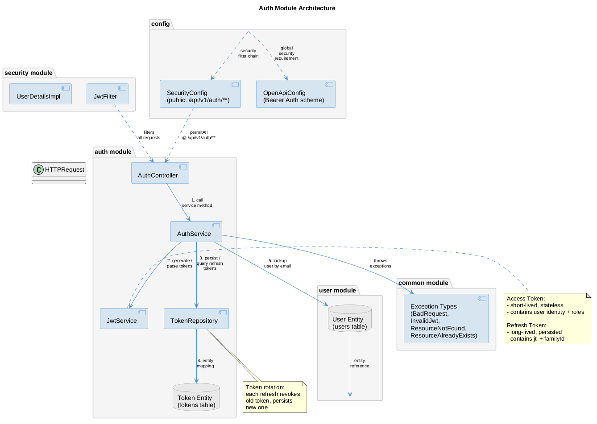

# Authentication Module

JWT-based user authentication, refresh token rotation, and session management.

## Overview

The `auth` module provides stateless JWT authentication for the Fitness Tracker API. It manages the complete authentication lifecycle: user registration, login, access/refresh token issuance, refresh token rotation, and logout with token revocation.

Key responsibilities:

- Register new user accounts with username, email, and password
- Authenticate users via email and password
- Issue short-lived access tokens and long-lived refresh tokens
- Rotate refresh tokens on each use to prevent reuse
- Revoke refresh token families on logout or detected misuse
- Enforce unique username and email constraints

The module operates in a stateless manner: access tokens are not stored server-side and are validated via cryptographic signature. Refresh tokens are persisted in the database to enable server-side revocation, rotation, and session tracking.

## Resources

- **User** — registered account with username, email, and encoded password
- **Token** — persistent refresh token record linked to a user and a token family
- **Token Family** — groups refresh tokens issued during the same login session

## Dependencies

- `user` module — provides `User`, `UserRepository`, `Role`, `UserMapper`
- `security` module — provides `JwtFilter`, `UserDetailsImpl`, `SecurityConfig`
- `common` module — provides exception types and error handling

## Architecture

## Documentation

- [API Reference](api.md) — endpoint details, request/response schemas, error codes
- [Business Rules](business-rules.md) — token rotation, revocation, session management
- [Frontend Integration](frontend.md) — how to consume the auth API from a frontend