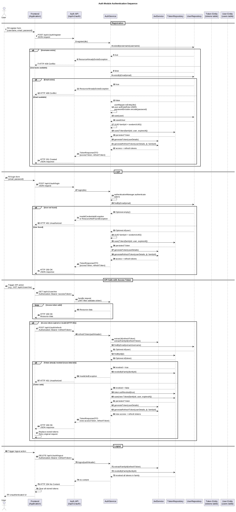

# Frontend Integration

## What the User Can Do

| User Action | API Endpoint | Required Input |
|-------------|--------------|----------------|
| Register new account | `POST /api/v1/auth/register` | username, email, password |
| Login | `POST /api/v1/auth/login` | email, password |
| Refresh access token | `POST /api/v1/auth/refresh` | valid refresh token (Authorization header) |
| Logout (revoke tokens) | `DELETE /api/v1/auth/logout` | valid refresh token (Authorization header) |

## Resources and Display

### User Account
- Display username and email after registration/login
- Access token used for authenticated API calls
- Refresh token stored securely (HTTP-only recommended) for token renewal

### Authentication State
- Frontend should track whether user is logged in (has valid access token)
- Access token has short lifespan — must be refreshed via refresh token
- On token expiry, attempt silent refresh using stored refresh token

## Forms and Fields

### Register Form
| Field | Required | Validation | Notes |
|-------|----------|------------|-------|
| username | Yes | Not blank | Must be unique across system |
| email | Yes | Valid email format | Must be unique across system |
| password | Yes | Min 8 characters | Strength validation recommended |

### Login Form
| Field | Required | Validation | Notes |
|-------|----------|------------|-------|
| email | Yes | Valid email format | |
| password | Yes | Not blank | |

## Endpoint Mapping to User Actions

### Registration
1. User fills register form and submits
2. `POST /api/v1/auth/register` → receives `accessToken` and `refreshToken`
3. Store `refreshToken` securely (e.g., cookies, localStorage with secure flags)
4. Store `accessToken` for authenticated API calls (e.g., Authorization header)
5. UI shows authenticated state and navigation changes

### Login
1. User fills login form and submits
2. `POST /api/v1/auth/login` → receives `accessToken` and `refreshToken`
3. Store tokens as per registration flow
4. UI shows authenticated state

### Refresh Token
1. Access token expires (frontend detects 401 or detects expiration)
2. `POST /api/v1/auth/refresh` with `Authorization: Bearer <refreshToken>`
3. Receive new `accessToken` and `refreshToken`
4. Replace stored tokens with new ones
5. Retry original request with new access token

### Logout
1. User triggers logout action
2. `DELETE /api/v1/auth/logout` with `Authorization: Bearer <refreshToken>`
3. Clear all stored tokens
4. UI shows unauthenticated state

## Required Error Handling

The frontend must handle these error responses:

| Endpoint | Status | Frontend Action |
|----------|--------|-----------------|
| `POST /api/v1/auth/register` | 400 | Show validation errors for each field |
| `POST /api/v1/auth/register` | 409 | Show error: "Username or email already exists" |
| `POST /api/v1/auth/login` | 401 | Show error: "Invalid email or password" |
| `POST /api/v1/auth/refresh` | 400 | Clear tokens, show error: "Missing or malformed refresh token" |
| `POST /api/v1/auth/refresh` | 401 | Clear tokens, show error: "Invalid or expired refresh token", redirect to login |
| `DELETE /api/v1/auth/logout` | 401 | Clear tokens regardless (user triggered logout) |

## Authentication Sequence

## Token Persistence Recommendations

- **Refresh token**: Store in HTTP-only, Secure cookie or secure server-side session
- **Access token**: Store in client memory or localStorage; include in Authorization header for API calls
- When access token expires, automatically attempt refresh before showing login prompt
- On refresh failure (401/400), clear all tokens and prompt user to re-login