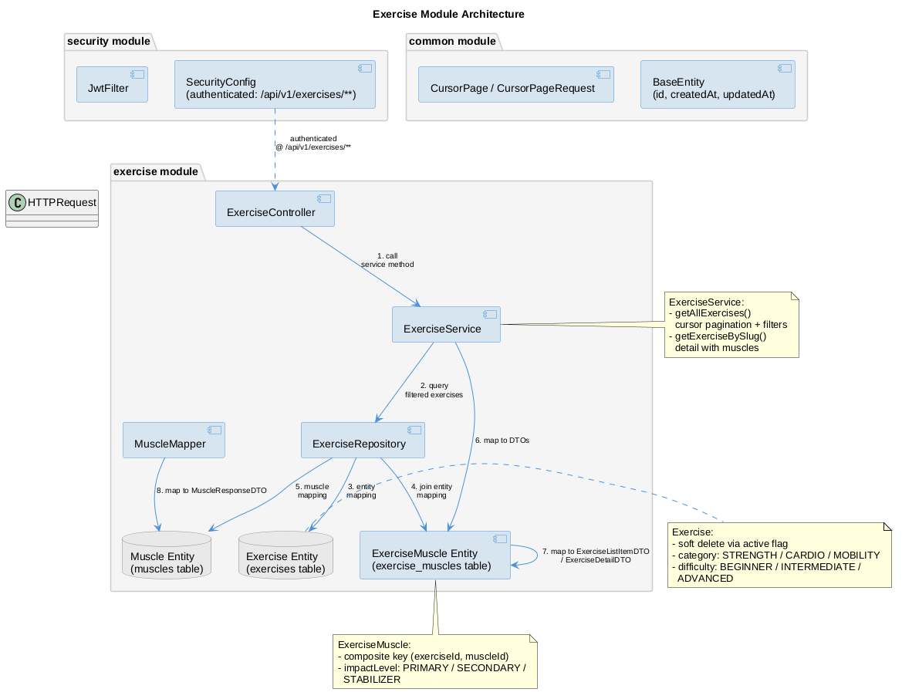

# Exercise Module

Read-only catalog of exercises and muscles with filtering and pagination.

## Overview

The `exercise` module provides read-only access to the exercise catalog and muscle directory. It supports cursor-based pagination, multi-field filtering, and exercise-to-muscle relationship lookups.

Key responsibilities:

- Maintain an exercise catalog with soft deletion (active flag)
- Categorize exercises by type, difficulty, and target muscles
- Provide paginated exercise listings with multi-field filters
- Maintain a muscle directory organized by body region
- Expose exercise-to-muscle relationships with impact levels

The module is read-only: no create/update/delete operations are exposed via API.

## Resources

- **Exercise** — catalog entry with name, slug, description, instructions, category, difficulty, muscle relationships and a nullable `gifUrl` (demo GIF placeholder). The internal `media_object_key` storage key is never exposed via API.
- **Muscle** — target muscle group with body region classification
- **ExerciseMuscle** — join entity linking exercises to muscles with impact level (primary, secondary, stabilizer)

## Dependencies

- `auth` module — provides JWT authentication (all endpoints require Bearer token)
- `common` module — provides base entity, pagination utilities, exception types

## Architecture

## Documentation

- [API Reference](api.md) — endpoint details, request/response schemas, error codes
- [Business Rules](business-rules.md) — filtering logic, soft deletion, category validation
- [Frontend Integration](frontend.md) — how to consume the exercise API from a frontend
