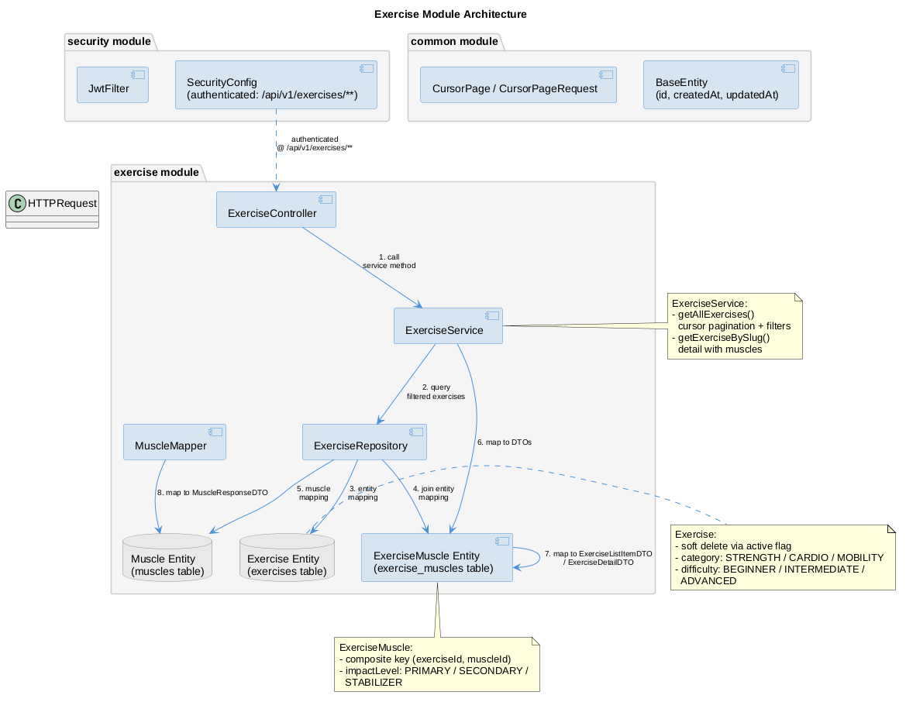

# Exercise Module

Catalog of exercises and muscles with filtering, pagination, and ADMIN-only exercise maintenance.

## Overview

The `exercise` module provides authenticated access to the exercise catalog and muscle directory. It supports cursor-based pagination, multi-field filtering, exercise-to-muscle relationship lookups, and ADMIN-only exercise creation, update, and soft deletion.

Key responsibilities:

- Maintain an exercise catalog with soft deletion (active flag)
- Categorize exercises by type, difficulty, and target muscles
- Provide paginated exercise listings with multi-field filters
- Maintain a muscle directory organized by body region
- Expose exercise-to-muscle relationships with impact levels

Regular users can read the catalog; exercise creation, full update, and soft deletion are restricted to the `ADMIN` role.

## Resources

- **Exercise** — catalog entry with name, slug, description, instructions, category, difficulty, muscle relationships, and a nullable `gifUrl` placeholder. The internal `media_object_key` storage key is never exposed via API.
- **Muscle** — target muscle group with body-region classification and a stable slug used in filters and write requests
- **ExerciseMuscle** — join entity linking exercises to muscles with impact level (primary, secondary, stabilizer)

## Muscle slugs

Use these exact slugs in `muscleSlugs` filters and in `muscles[].muscleSlug` when creating or updating an exercise.

| Body region | Available slugs |
|-------------|-----------------|
| CHEST | `chest-upper`, `chest-lower` |
| BACK | `rhomboids`, `lats-upper`, `lats-mid`, `lats-lower`, `lower-back-erectors`, `lower-back-ql`, `gluteus-maximus`, `gluteus-medius` |
| SHOULDERS | `rotator-cuff`, `shoulder-front`, `shoulder-side`, `deltoid-rear`, `traps-upper`, `traps-mid`, `traps-lower` |
| ARMS | `biceps`, `brachialis`, `triceps-long`, `triceps-lateral`, `forearm-flexors`, `forearm-extensors` |
| CORE | `abs-upper`, `abs-lower`, `obliques`, `serratus-anterior` |
| LEGS | `feet`, `quads`, `hamstrings-medial`, `hamstrings-lateral`, `adductors`, `tibialis-anterior`, `calves-gastroc-medial`, `calves-gastroc-lateral`, `calves-soleus`, `hip-flexor` |
| OTHER | `head`, `face`, `neck`, `nape` |

## Dependencies

- `auth` module — provides JWT bearer authentication (all endpoints require an authenticated user)
- `common` module — provides base entity, pagination utilities, exception types

## Architecture

## Documentation

- [API Reference](api.md) — endpoint details, request/response schemas, error codes
- [Business Rules](business-rules.md) — filtering logic, soft deletion, category validation
- [Frontend Integration](frontend.md) — how to consume the exercise API from a frontend
