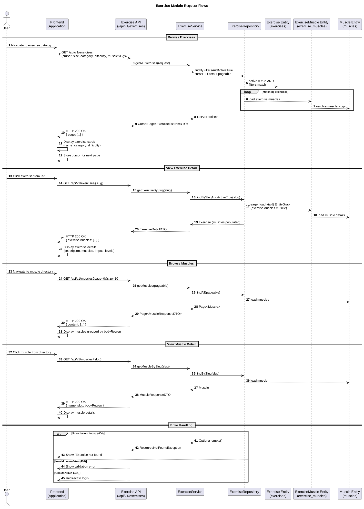

# Frontend Integration

## What the User Can Do

| User Action | API Endpoint | Required Input |
|-------------|--------------|----------------|
| Browse exercises | `GET /api/v1/exercises` | Pagination params, optional filters |
| View exercise details | `GET /api/v1/exercises/{slug}` | Exercise slug |
| Browse muscles | `GET /api/v1/muscles` | Pagination params |
| View muscle details | `GET /api/v1/muscles/{slug}` | Muscle slug |

## Resources and Display

### Exercise List
- Display exercise name, category, and difficulty
- Use cursor pagination for infinite scroll or page navigation
- Filter by category, difficulty, or target muscle

### Exercise Detail
- Display full exercise description
- Display `instructions` as a numbered step-by-step list (field may be `null` — hide the section in that case)
- Display the demonstration GIF from `gifUrl` when present. Note: `gifUrl` is currently always `null` (backend placeholder), so show a placeholder or hide the image until the backend starts resolving URLs. Do not try to build the GIF URL client-side from any other field — there is no public key exposed.
- Show target muscles with impact levels (primary, secondary, stabilizer). Stabilizer data is populated, so grouping/filtering by stabilizer muscles is meaningful.
- Exercise muscles are loaded eagerly for detail view

### Muscle Directory
- Display muscles organized by body region
- Use for filtering exercises by muscle group

## Forms and Fields

### Exercise List Filter Form
| Field | Required | Validation | Notes |
|-------|----------|------------|-------|
| cursor | No | Valid UUID | Cursor from previous response |
| size | No | 1-100, positive | Default applied by server |
| category | No | Valid enum value | STRENGTH, CARDIO, MOBILITY |
| difficulty | No | Valid enum value | BEGINNER, INTERMEDIATE, ADVANCED |
| muscleSlugs | No | One or more slugs | Comma-separated or array |

### Exercise Detail View
No form input required. Navigate by slug from exercise list.

### Muscle Directory
No form input required. Navigate by slug from muscle list.

## Endpoint Mapping to User Actions

### Browse Exercises
1. User navigates to exercise catalog
2. `GET /api/v1/exercises` with optional filters → receives paginated exercise list
3. Display exercise name, category, difficulty
4. User can filter by category, difficulty, or muscle
5. User scrolls to next page → use cursor from previous response

### View Exercise Detail
1. User selects an exercise from the list
2. `GET /api/v1/exercises/{slug}` → receives full exercise details
3. Display exercise name, description, category, difficulty
4. Display `instructions` as numbered steps (if present)
5. Display GIF from `gifUrl` (if present; currently always `null`)
6. Display associated muscles with impact levels

### Browse Muscles
1. User navigates to muscle directory
2. `GET /api/v1/muscles` → receives paginated muscle list
3. Display muscle name, body region
4. User can filter by body region

### View Muscle Details
1. User selects a muscle
2. `GET /api/v1/muscles/{slug}` → receives muscle details
3. Display muscle name, body region

## Required Error Handling

| Endpoint | Status | Frontend Action |
|----------|--------|-----------------|
| `GET /api/v1/exercises` | 400 | Show validation error (e.g., size > 100) |
| `GET /api/v1/exercises` | 401 | Redirect to login |
| `GET /api/v1/exercises/{slug}` | 400 | Show error: "Slug is required" |
| `GET /api/v1/exercises/{slug}` | 404 | Show exercise not found message |
| `GET /api/v1/exercises/{slug}` | 401 | Redirect to login |
| `GET /api/v1/muscles/{slug}` | 404 | Show muscle not found message |

## Data Flow

## Token Persistence Recommendations

- **Access token**: Store in client memory or localStorage; include in Authorization header for API calls
- All endpoints require Bearer token authentication
- On 401 response, redirect user to login