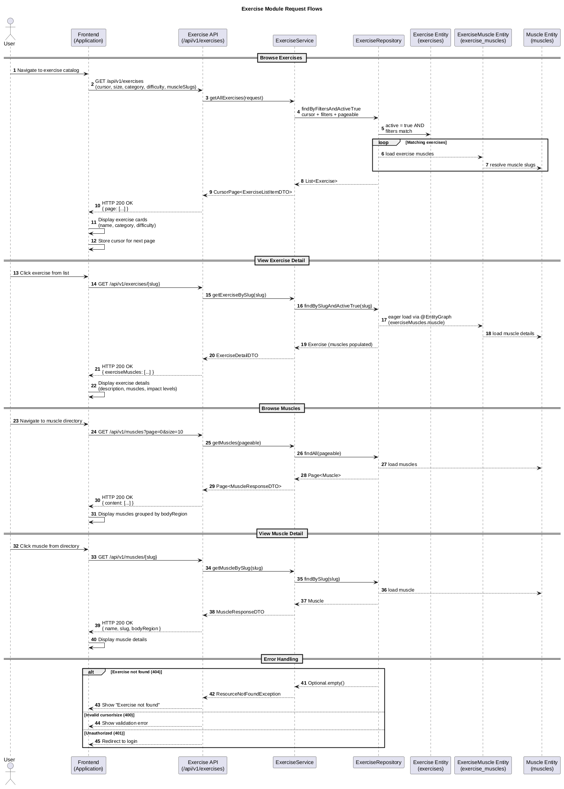

# Frontend Integration

## What the User Can Do

| User Action | API Endpoint | Required Input |
|-------------|--------------|----------------|
| Browse exercises | `GET /api/v1/exercises` | Pagination params, optional filters |
| View exercise details | `GET /api/v1/exercises/{slug}` | Exercise slug |
| Create, update, or delete exercise (admin) | `POST`, `PUT`, or `DELETE /api/v1/exercises` | `ADMIN` token and request body |
| Browse muscles | `GET /api/v1/muscles` | Pagination params |
| View muscle details | `GET /api/v1/muscles/{slug}` | Muscle slug |

## Resources and Display

### Exercise List

- Display exercise name, category, and difficulty.
- Use cursor pagination for infinite scroll or page navigation.
- Filter by category, difficulty, or a muscle slug from [the catalog](README.md#muscle-slugs).

### Exercise Detail

- Display the description and `instructions` as a numbered list; hide the section when empty.
- Display `gifUrl` when present. It is currently always `null`; do not build a GIF URL client-side from another field.
- Show target muscles with `PRIMARY`, `SECONDARY`, or `STABILIZER` impact levels.

### Muscle Directory

- Display muscles grouped by body region.
- Use the documented muscle slugs to filter exercises and navigate to details.

## Forms and Fields

### Exercise List Filter Form

| Field | Required | Validation | Notes |
|-------|----------|------------|-------|
| cursor | No | Valid UUID | Cursor from previous response |
| size | No | 1-100, positive | Default applied by server |
| category | No | Valid enum value | `STRENGTH`, `CARDIO`, `MOBILITY` |
| difficulty | No | Valid enum value | `BEGINNER`, `INTERMEDIATE`, `ADVANCED` |
| muscleSlugs | No | Existing muscle slugs | Comma-separated or array |

### Admin Exercise Forms

All write operations require the `ADMIN` role.

| Field | Required | Validation | Notes |
|-------|----------|------------|-------|
| name | Yes | Not blank | |
| slug | Yes | Not blank, unique | May change on update if the new value is free |
| description | Yes | Not blank | |
| instructions | No | Ordered list | Omitted or `null` defaults to `[]` |
| category | Yes | Valid enum value | `STRENGTH`, `CARDIO`, `MOBILITY` |
| difficulty | Yes | Valid enum value | `BEGINNER`, `INTERMEDIATE`, `ADVANCED` |
| muscles | No | Existing slug and impact level; no duplicate slugs | Replaces all associations on update |

## Endpoint Mapping

1. Call `GET /api/v1/exercises` with optional filters and display the returned page.
2. Use an exercise slug with `GET /api/v1/exercises/{slug}` to display details and muscles.
3. Use a muscle slug with `GET /api/v1/muscles/{slug}` to display muscle details.
4. For admins, use `POST`, `PUT`, and `DELETE` as documented in [the API reference](api.md).

## Required Error Handling

| Status | Frontend Action |
|--------|-----------------|
| 400 | Show the validation error |
| 401 | Redirect the user to login |
| 403 | Show an admin-only message |
| 404 | Show exercise or muscle not found |
| 409 | Show that the exercise slug already exists |

## Authentication

- Send `Authorization: Bearer <token>` on every request.
- On a 401 response, redirect the user to login.
- Do not expose or derive values from the internal `media_object_key`.

