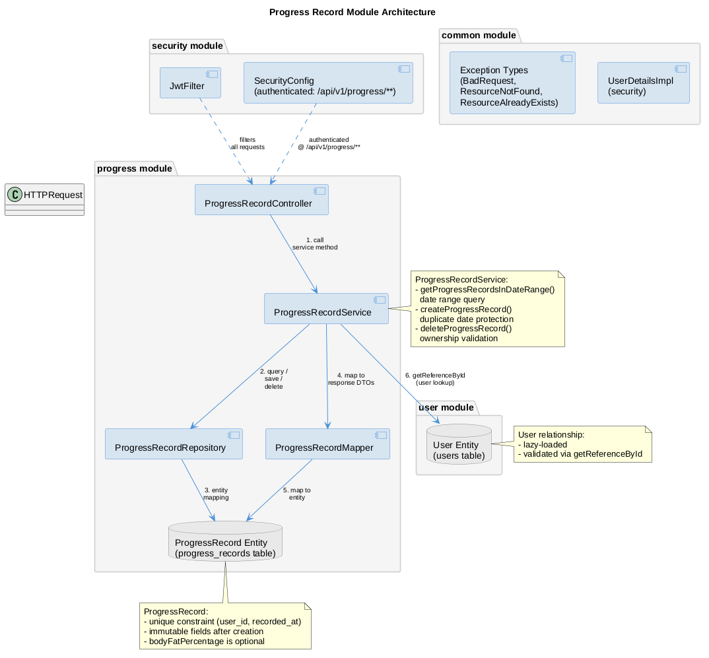

# Progress Record Module

User body measurement tracking with date range filtering and ownership-based access control.

## Overview

The `progress` module manages user progress records: weight and optional body fat percentage measurements taken on specific dates. It provides date range queries for charting/trending, record creation with duplicate date protection, and record deletion with ownership validation.

Key responsibilities:

- Store body measurement snapshots (weight, body fat percentage) per user per date
- Query records within a date range for trend visualization
- Prevent duplicate records per user per date
- Enforce record ownership (users can only access their own records)

The module is user-scoped: all operations are tied to the authenticated user via `@AuthenticationPrincipal`.

## Resources

- **ProgressRecord** — a single body measurement snapshot (date, weight, optional body fat)
- **User** — the owner of the progress record (from auth/user module)

## Dependencies

- `auth` module — provides JWT authentication (`UserDetailsImpl`)
- `user` module — provides `User` entity
- `common` module — provides exception types, pagination utilities

## Architecture

## Documentation

- [API Reference](api.md) — endpoint details, request/response schemas, error codes
- [Business Rules](business-rules.md) — validation, ownership, uniqueness constraints
- [Frontend Integration](frontend.md) — how to consume the progress API from a frontend
