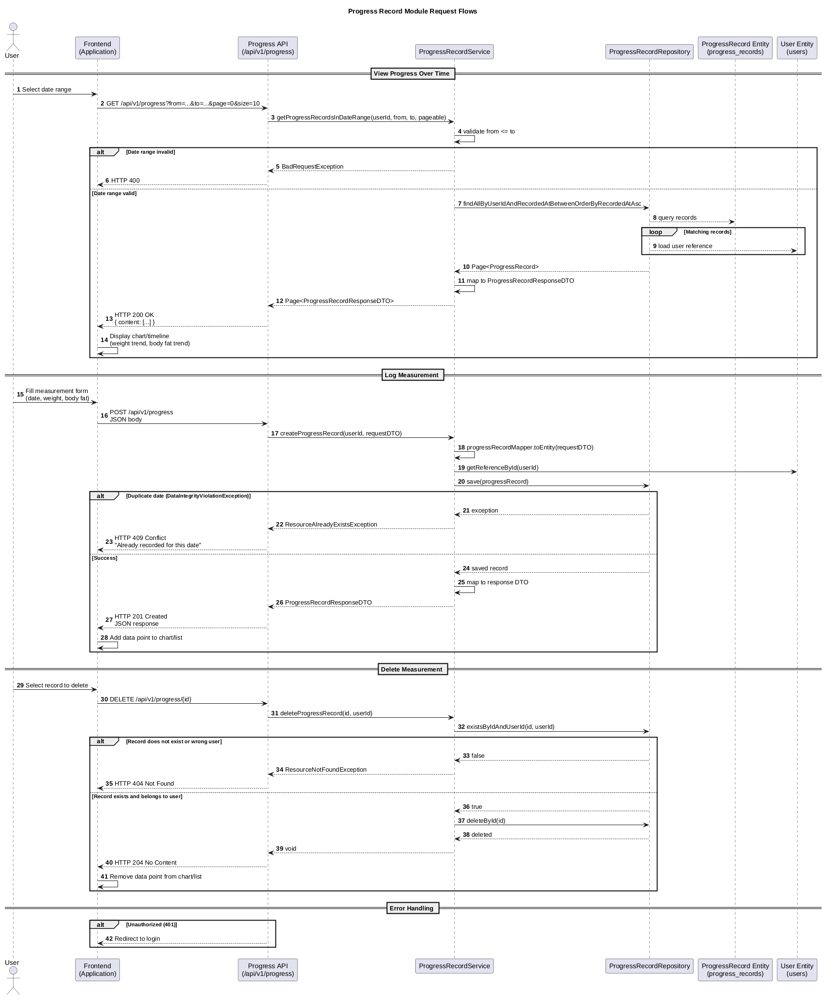

# Frontend Integration

## What the User Can Do

| User Action | API Endpoint | Required Input |
|-------------|--------------|----------------|
| View progress over time | `GET /api/v1/progress` | Date range (from, to) |
| Log weight/body fat | `POST /api/v1/progress` | Date, weight, optional body fat |
| Delete a measurement | `DELETE /api/v1/progress/{id}` | Progress record ID |

## Resources and Display

### Progress List
- Display records in a chart/timeline view (weight trend, body fat trend)
- Group by date for trend visualization
- Use pagination for large date ranges
- Show recordedAt, weightKg, bodyFatPercentage for each record

### Create Measurement
- Form fields: date picker, weight input, optional body fat input
- Validate weight > 0, body fat between 0-100
- Show error if a record already exists for the selected date

### Delete Measurement
- Confirm before deleting
- On success, update chart/list to remove the record

## Forms and Fields

### Progress List Filter Form
| Field | Required | Validation | Notes |
|-------|----------|------------|-------|
| from | Yes | Valid date | Start date (inclusive) |
| to | Yes | Valid date | End date (inclusive) |
| page | No | Integer ≥ 0 | Page number |
| size | No | Integer > 0 | Page size |

### Create Measurement Form
| Field | Required | Validation | Notes |
|-------|----------|------------|-------|
| recordedAt | Yes | Valid date, not in future | Date of measurement |
| weightKg | Yes | > 0, max 500 | Weight in kg |
| bodyFatPercentage | No | 0-100 | Body fat % (optional) |

## Endpoint Mapping to User Actions

### View Progress Over Time
1. User selects a date range
2. `GET /api/v1/progress?from=...&to=...` → receives paginated records
3. Display records in chart/timeline (weight trend, body fat trend)
4. User can navigate pages

### Log Measurement
1. User fills measurement form (date, weight, body fat)
2. `POST /api/v1/progress` with JSON body → receives created record
3. Add new data point to chart/list
4. If 409 error, show "Already recorded for this date" message

### Delete Measurement
1. User selects a record to delete
2. `DELETE /api/v1/progress/{id}` → 204 on success
3. Remove data point from chart/list

## Required Error Handling

| Endpoint | Status | Frontend Action |
|----------|--------|-----------------|
| `GET /api/v1/progress` | 400 | Show "Start date cannot be after end date" |
| `GET /api/v1/progress` | 401 | Redirect to login |
| `POST /api/v1/progress` | 400 | Show validation errors for each field |
| `POST /api/v1/progress` | 409 | Show "A progress record already exists for this date" |
| `POST /api/v1/progress` | 401 | Redirect to login |
| `DELETE /api/v1/progress/{id}` | 404 | Show "Progress record not found" |
| `DELETE /api/v1/progress/{id}` | 401 | Redirect to login |

## Data Flow

## Token Persistence Recommendations

- **Access token**: Store in client memory or localStorage; include in Authorization header for API calls
- All endpoints require Bearer token authentication
- On 401 response, redirect user to login