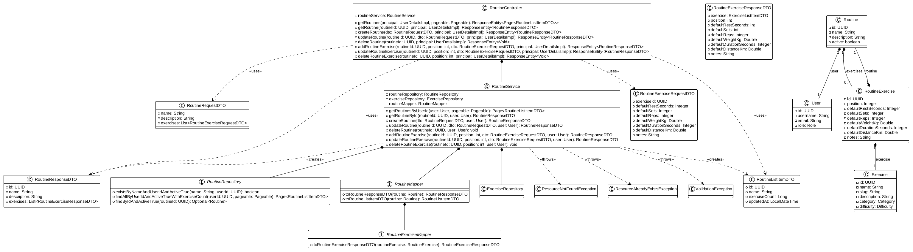

# Routine Module

Manages user routines - collections of exercises with predefined structures and repetitions.

## Overview

The `routine` module manages user routines and their exercise sequences. It supports full CRUD operations on routines, exercise positioning within routines, and category-specific validation of exercise metrics.

Key responsibilities:

- Define and manage exercise sequences for workouts
- Handle exercise positioning within routines
- Support adding, updating, and removing exercises from routines
- Ensure proper ordering and constraints on routine structure

## Resources

- **Routine** — the primary entity representing a collection of exercises
- **RoutineExercise** — individual exercise placed at a specific position in a routine
- **Exercise** — the underlying exercise entity referenced by routines

## Dependencies

- `auth` module — provides JWT authentication (all endpoints require Bearer token)
- `user` module — provides `User` entity
- `common` module — provides base entity, pagination utilities, exception types

## Architecture

## Documentation

- [API Reference](api.md) — endpoint details, request/response schemas, error codes
- [Business Rules](business-rules.md) — validation, uniqueness constraints, ordering rules
- [Frontend Integration](frontend.md) — how to consume the routine API from a frontend