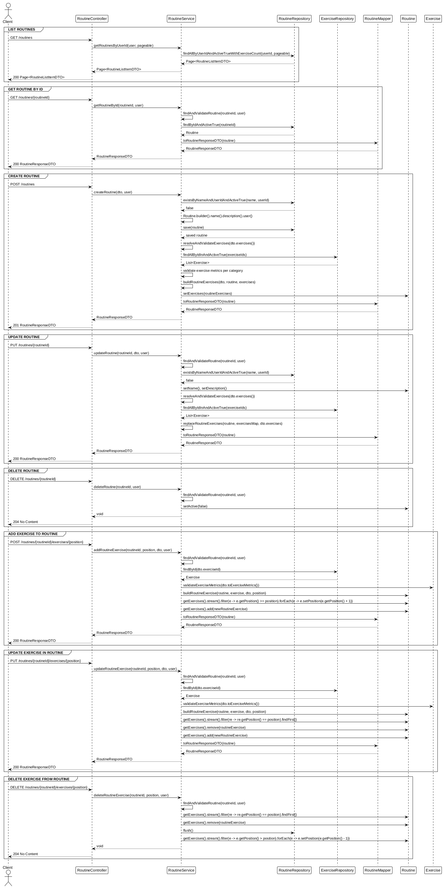

# Frontend Integration

## What the User Can Do

| User Action | API Endpoint | Required Input |
|-------------|--------------|----------------|
| List routines | `GET /api/v1/routines` | Pagination params |
| View routine details | `GET /api/v1/routines/{routineId}` | Routine ID |
| Create a routine | `POST /api/v1/routines` | Name, description, exercises |
| Update a routine | `PUT /api/v1/routines/{routineId}` | Routine ID, updated fields |
| Delete a routine | `DELETE /api/v1/routines/{routineId}` | Routine ID |
| Add exercise to routine | `POST /api/v1/routines/{routineId}/exercises/{position}` | Exercise ID, position, metrics |
| Update exercise in routine | `PUT /api/v1/routines/{routineId}/exercises/{position}` | Exercise ID, metrics |
| Remove exercise from routine | `DELETE /api/v1/routines/{routineId}/exercises/{position}` | Routine ID, position |

## Resources and Display

### Routine List
- Display routine name, exercise count, last updated date
- Use pagination for large lists
- Show exercise count for each routine

### Routine Detail
- Display routine name and description
- Show ordered list of exercises with their metrics
- Each exercise shows: name, position, sets, reps, weight, duration, distance, rest, notes
- Allow editing exercise order and metrics

### Create/Edit Routine
- Form fields for name, description, and exercises
- Support adding exercises from the exercise catalog

## Forms and Fields

### Create/Update Routine Form
| Field | Required | Validation | Notes |
|-------|----------|------------|-------|
| name | Yes | Not blank, unique per user | Routine name |
| description | No | - | Optional description |
| exercises | No | Valid exercise IDs | Array of exercise items |

### Routine Exercise Form
| Field | Required | Validation | Notes |
|-------|----------|------------|-------|
| exerciseId | Yes | Valid UUID | Exercise to add |
| defaultRestSeconds | Yes | ≥ 0 | Rest between sets |
| defaultSets | Yes | > 0 | Number of sets |
| defaultReps | No | ≥ 0; category-dependent | Repetitions per set |
| defaultWeightKg | No | ≥ 0; category-dependent | Weight in kilograms |
| defaultDurationSeconds | No | ≥ 0; category-dependent | Duration in seconds |
| defaultDistanceKm | No | ≥ 0; category-dependent | Distance in kilometers |
| notes | No | - | Optional notes |

### Position Field
| Field | Required | Validation | Notes |
|-------|----------|------------|-------|
| position | Yes | Integer ≥ 1 | 1-based position in routine |

## Endpoint Mapping to User Actions

### List Routines
1. User navigates to routine list
2. `GET /api/v1/routines` with pagination params → receives paginated routine list
3. Display routine name, exercise count, last updated date
4. User can click to view details or edit

### View Routine Details
1. User selects a routine from the list
2. `GET /api/v1/routines/{routineId}` → receives full routine details
3. Display routine name, description, and ordered exercises
4. Show exercise metrics (sets, reps, weight, duration, distance)
5. Allow editing exercise order and metrics

### Create Routine
1. User fills routine creation form
2. `POST /api/v1/routines` with JSON body → receives created routine
3. Add new routine to list view
4. Show success message and navigate to new routine

### Update Routine
1. User modifies routine details
2. `PUT /api/v1/routines/{routineId}` with updated fields → receives updated routine
3. Refresh routine view
4. Show success message

### Delete Routine
1. User confirms deletion
2. `DELETE /api/v1/routines/{routineId}` → 204 on success
3. Remove routine from list view
4. Show success message

### Add Exercise to Routine
1. User selects an exercise from the catalog
2. `POST /api/v1/routines/{routineId}/exercises/{position}` → receives updated routine
3. Display updated exercise list with new exercise at specified position
4. Show success message

### Update Exercise in Routine
1. User modifies exercise metrics
2. `PUT /api/v1/routines/{routineId}/exercises/{position}` → receives updated routine
3. Refresh exercise list
4. Show success message

### Remove Exercise from Routine
1. User confirms removal
2. `DELETE /api/v1/routines/{routineId}/exercises/{position}` → 204 on success
3. Refresh exercise list
4. Show success message

## Required Error Handling

| Endpoint | Status | Frontend Action |
|----------|--------|-----------------|
| `GET /api/v1/routines` | 401 | Redirect to login |
| `GET /api/v1/routines/{routineId}` | 404 | Show "Routine not found" |
| `GET /api/v1/routines/{routineId}` | 401 | Redirect to login |
| `POST /api/v1/routines` | 400 | Show validation errors for each field |
| `POST /api/v1/routines` | 409 | Show "Routine name already exists" |
| `PUT /api/v1/routines/{routineId}` | 400 | Show validation errors for each field |
| `PUT /api/v1/routines/{routineId}` | 404 | Show "Routine not found" |
| `DELETE /api/v1/routines/{routineId}` | 404 | Show "Routine not found" |
| `POST /api/v1/routines/{routineId}/exercises/{position}` | 400 | Show validation errors |
| `POST /api/v1/routines/{routineId}/exercises/{position}` | 404 | Show "Routine or exercise not found" |
| `PUT /api/v1/routines/{routineId}/exercises/{position}` | 400 | Show validation errors |
| `PUT /api/v1/routines/{routineId}/exercises/{position}` | 404 | Show "Routine or exercise not found" |
| `DELETE /api/v1/routines/{routineId}/exercises/{position}` | 404 | Show "Exercise not found" |

## Data Flow

## Token Persistence Recommendations

- **Access token**: Store in client memory or localStorage; include in Authorization header for API calls
- All endpoints require Bearer token authentication
- On 401 response, redirect user to login

## Category-Specific Metrics

The API validates the complete metric combination against the referenced exercise:

- **STRENGTH**: positive `defaultReps` and `defaultWeightKg`; duration and distance must be omitted
- **CARDIO**: positive `defaultDurationSeconds` or `defaultDistanceKm`; reps and weight must be omitted
- **MOBILITY**: positive `defaultDurationSeconds`; reps, weight, and distance must be omitted

The frontend should clear incompatible metric fields when the selected exercise changes category and display the validation response without assuming that every optional field is accepted for every category.