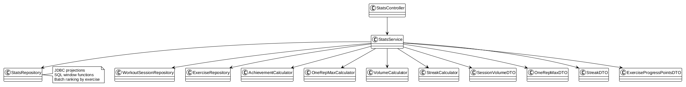
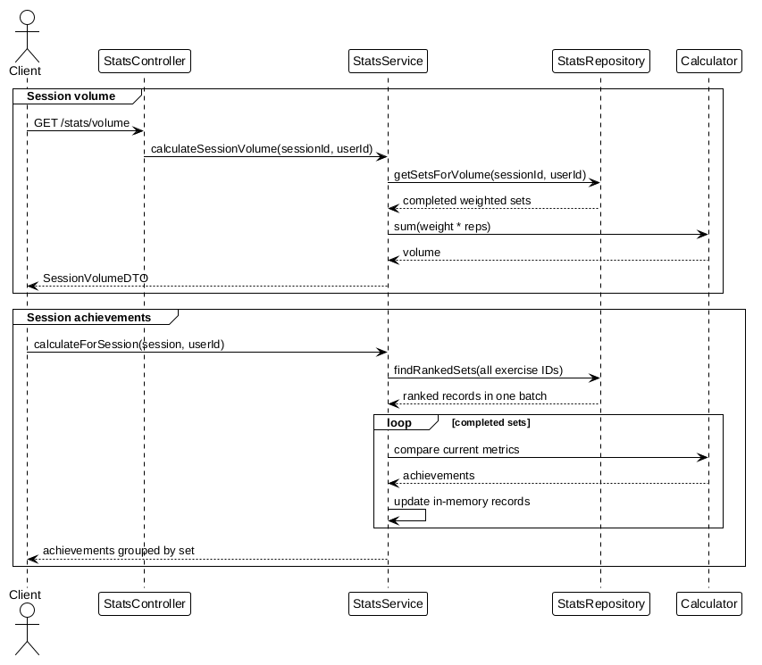

# Statistics Module

Provides user-scoped monthly and session workout volume, estimated one-repetition maximum, streak, progression, muscle-intensity visualization, and achievement data.

## Documentation

- [API Reference](api.md)
- [Business Rules and Calculation Semantics](business-rules.md)
- [Frontend Integration](frontend.md)

The statistics implementation uses JDBC aggregate queries. Batch behavior and implicit defaults are documented explicitly in the business-rules guide. Composite indexes support the user/date, session/exercise, and completed-set predicates used by the reporting queries.

