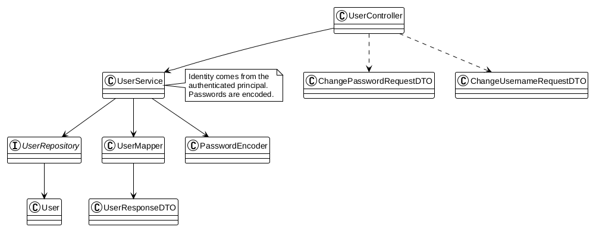
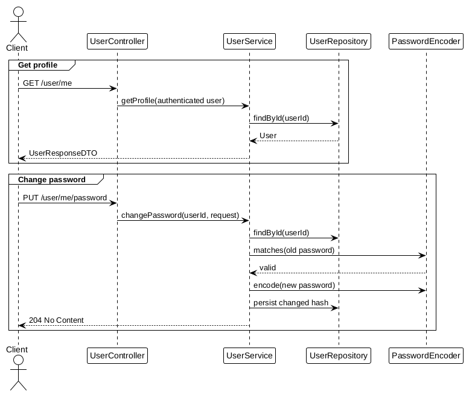

# User Module

Manages the authenticated user's profile and credentials.

## Responsibilities

- Return the current user's public profile
- Change the authenticated user's password after verifying the old password
- Change the authenticated user's username
- Keep password hashes and internal roles out of API responses
- Store a user timezone used by streak and progress calculations

## Documentation

- [API Reference](api.md)
- [Business Rules](business-rules.md)
- [Frontend Integration](frontend.md)

User identity is taken from the authenticated principal. No endpoint accepts a user ID from the client for profile or credential changes.

