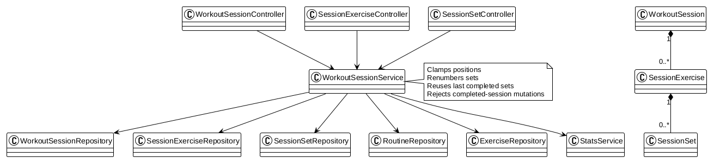
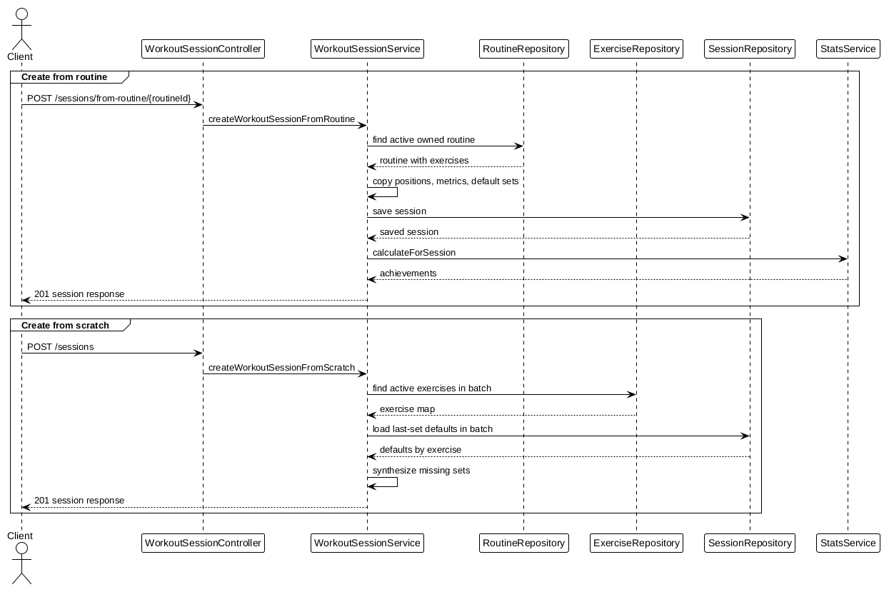

# Workout Session Module

Manages live and completed workout sessions, ordered exercises, performed sets, notes, and completion state.

## Documentation

- [API Reference](api.md)
- [Business Rules and Implicit Behavior](business-rules.md)
- [Frontend Integration](frontend.md)

Workout mutations are rejected after a session is completed. Position and set-number normalization is performed implicitly by the service.

